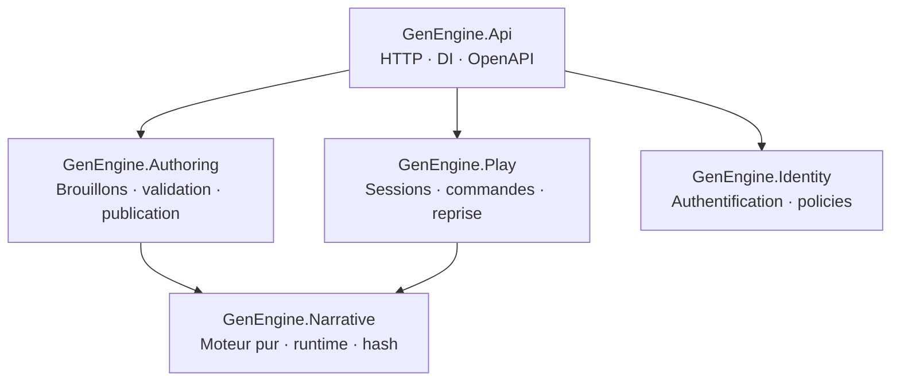

<div align="center">

# GenEngine

**Moteur narratif backend déterministe, autoritatif et extensible en .NET 10 LTS.**

[](https://github.com/JordanLacroix/GenEngine/actions/workflows/ci.yml)
[](https://github.com/JordanLacroix/GenEngine/actions/workflows/codeql.yml)
[](https://github.com/JordanLacroix/GenEngine/actions/workflows/scorecard.yml)
[](https://dotnet.microsoft.com/)
[](https://learn.microsoft.com/dotnet/csharp/)
[](#état-du-projet)
[](https://github.com/JordanLacroix/GenEngine/commits/main)
[](#licence)

[Vision](#vision) · [Démarrage rapide](#démarrage-rapide) · [Architecture](#architecture) · [Roadmap](#roadmap) · [Documentation](#documentation) · [Contribuer](#contribuer)

</div>

---

## Vision

GenEngine fournit le socle serveur d’expériences narratives de type « livre dont vous êtes le héros » : scénarios déclaratifs, conditions, effets, sessions, sauvegardes et publication de versions immuables.

Le projet vise un moteur :

- **déterministe** — mêmes versions, état, graine et commandes, même résultat ;
- **autoritatif** — le serveur contrôle les transitions et l’état des sessions ;
- **testable** — le cœur narratif reste une logique métier pure ;
- **portable** — aucun cloud ou fournisseur d’IA obligatoire ;
- **évolutif** — monolithe modulaire, extensions ajoutées selon des besoins validés ;
- **sobre en dépendances** — licences permissives et compatibles avec un usage commercial.

> [!IMPORTANT]
> GenEngine est actuellement au **jalon 0**. Le dépôt contient le squelette technique, les règles d’architecture et les premières spécifications. Le moteur narratif n’est pas encore implémenté.

## État du projet

| Élément | État |
|---|---|
| Solution .NET 10 et bounded contexts | ✅ Initialisé |
| Build sans warning | ✅ Vérifié |
| Frontières de dépendance automatisées | ✅ Vérifiées en CI |
| Health checks API | ✅ Disponibles |
| Spécifications et invariants initiaux | 🚧 En cours |
| Scénarios JSON de référence | ⏳ À faire |
| Moteur narratif en mémoire | ⏳ Jalon 1 |
| PostgreSQL et sessions persistées | ⏳ Jalon 2 |
| Docker Compose | ⏳ Jalon 2 |
| IA, économie et multi-tenant | ⏸️ Hors V1 |

La progression détaillée est suivie dans [`specs/roadmap.md`](specs/roadmap.md) et dans les fichiers `tasks.md` de chaque module.

## Démarrage rapide

### Prérequis

- [.NET SDK 10](https://dotnet.microsoft.com/download/dotnet/10.0) — version attendue définie dans [`global.json`](global.json) ;
- Git ;
- Docker avec Docker Compose à partir du jalon 2.

### Cloner et vérifier

```bash
git clone https://github.com/JordanLacroix/GenEngine.git
cd GenEngine

dotnet restore --locked-mode
dotnet build --no-restore -warnaserror
dotnet test --no-build
```

Les tests d’architecture protègent déjà le graphe de dépendances. Les premiers tests métier arriveront avec l’implémentation du Domain au jalon 1.

### Lancer l’API

```bash
dotnet run --project src/GenEngine.Api --launch-profile http
```

Vérifier ensuite les health checks :

```bash
curl http://localhost:5201/health/live
curl http://localhost:5201/health/ready
```

| Endpoint | Rôle |
|---|---|
| `GET /health/live` | Confirme que le processus répond |
| `GET /health/ready` | Confirme que les dépendances indispensables sont disponibles |

## Architecture

GenEngine est un **monolithe modulaire DDD/Clean pragmatique** : un seul déployable, un assembly par bounded context et un Domain narratif indépendant de tout framework.



### Modules

| Projet | Responsabilité |
|---|---|
| `GenEngine.Narrative` | Modèle, conditions, effets locaux, runtime, PRNG, snapshots et migrations |
| `GenEngine.Authoring` | Import, validation, brouillons, versioning, publication et ses propres adaptateurs |
| `GenEngine.Play` | Sessions, commandes, idempotence, pause, reprise et ses propres adaptateurs |
| `GenEngine.Identity` | Authentification locale, autorisation minimale et ses propres adaptateurs |
| `GenEngine.Api` | Minimal API, composition, OpenAPI et préoccupations HTTP |

### Règles de dépendance

1. `Narrative` ne référence ni ASP.NET Core, ni EF Core, ni un autre module métier.
2. `Authoring` et `Play` sont les seuls modules autorisés à référencer `Narrative`.
3. Chaque module possède ses cas d’usage, son infrastructure, son schéma et ses migrations.
4. Aucun module ne lit directement les tables ou les types internes d’un autre module.
5. `Api` compose l’application sans contenir de logique métier ni de persistance.
6. Une liste blanche exhaustive protège ces références dans les tests d’architecture.

## Structure du dépôt

```text
GenEngine/
├── src/
│   ├── Modules/
│   │   ├── GenEngine.Narrative/
│   │   ├── GenEngine.Authoring/
│   │   ├── GenEngine.Play/
│   │   └── GenEngine.Identity/
│   └── GenEngine.Api/
├── tests/
│   ├── GenEngine.Narrative.Tests/
│   ├── GenEngine.Modules.Tests/
│   ├── GenEngine.Architecture.Tests/
│   └── GenEngine.Api.IntegrationTests/
├── specs/
├── .github/workflows/
└── GenEngine.sln
```

## Principes techniques

- Les scénarios sont déclaratifs et typés ; aucun script auteur arbitraire n’est exécuté.
- Une version publiée est immuable et possède un hash canonique.
- Une session reste attachée à sa version publiée initiale.
- Le moteur ne réalise aucun accès réseau, disque ou base de données.
- Les commandes joueur seront idempotentes et protégées par une révision optimiste.
- L’IA est différée, facultative et exclue du chemin déterministe.
- Les fonctionnalités de plateforme ne sont pas anticipées sans cas d’usage concret.

Les invariants normatifs sont listés dans [`specs/invariants.md`](specs/invariants.md).

## Commandes de développement

```bash
# Restauration reproductible
dotnet restore --locked-mode

# Compilation stricte
dotnet build --no-restore -warnaserror

# Tests
dotnet test --no-build

# Audit des vulnérabilités directes et transitives
dotnet list GenEngine.sln package --vulnerable --include-transitive

# Lancement local de l’API
dotnet run --project src/GenEngine.Api --launch-profile http
```

Les versions NuGet sont centralisées dans [`Directory.Packages.props`](Directory.Packages.props) et verrouillées par projet avec `packages.lock.json`.

## Qualité et sécurité

- nullable activé ;
- C# 14 et .NET 10 LTS ;
- warnings traités comme erreurs ;
- restore NuGet verrouillé en CI ;
- dépendances directes et transitives auditées ;
- GitHub Actions avec permissions minimales ;
- actions tierces épinglées par SHA et auditées par zizmor ;
- CodeQL, Trivy, Dependency Review et OpenSSF Scorecard ;
- SBOM SPDX générée automatiquement sur `main` ;
- Dependabot, secret scanning et push protection ;
- aucune donnée personnelle ou texte libre dans les logs par défaut ;
- threat model requis avant toute exposition publique de l’API.

Le workflow [`ci.yml`](.github/workflows/ci.yml) exécute la restauration, le build strict et les tests à chaque pull request et push sur `main`. La matrice complète des protections, outils actifs et intégrations différées est tenue dans [`specs/process/github-governance.md`](specs/process/github-governance.md).

## Documentation

| Document | Contenu |
|---|---|
| [`specs/README.md`](specs/README.md) | Index documentaire et sources de vérité |
| [`specs/roadmap.md`](specs/roadmap.md) | Jalons et progression |
| [`specs/architecture.md`](specs/architecture.md) | Modules et règles de dépendance |
| [`specs/invariants.md`](specs/invariants.md) | Invariants non négociables |
| [`specs/glossary.md`](specs/glossary.md) | Vocabulaire métier |
| [`specs/adr/`](specs/adr/) | Architecture Decision Records |
| [`specs/modules/narrative/tasks.md`](specs/modules/narrative/tasks.md) | Tâches du premier module |
| [`specs/process/github-governance.md`](specs/process/github-governance.md) | Gouvernance GitHub, CI/CD et sécurité |

### Maintenir ce README

Le README doit rester une représentation exacte du projet. Toute PR modifiant l’un des éléments suivants doit vérifier et, si nécessaire, mettre à jour ce fichier :

- prérequis ou commandes de démarrage ;
- architecture, modules ou dépendances ;
- endpoints publics ;
- statut d’un jalon ;
- politique de sécurité ou de licence ;
- liens vers la documentation ;
- badges et workflow CI.

Ne jamais annoncer une fonctionnalité comme disponible avant qu’elle soit implémentée et vérifiée.

## Roadmap

| Jalon | Objectif | Statut |
|---|---|---|
| **0 — Cadrage** | Scénarios de référence, invariants, JSON polymorphe, PRNG, hash et ADR | 🚧 En cours |
| **1 — Moteur en mémoire** | Domain, evaluator, reducer, runtime, migrations et tests déterministes | ⏳ Planifié |
| **2 — Backend jouable** | PostgreSQL, authoring, publication, sessions, API, auth locale et Docker | ⏳ Planifié |
| **3 — Durcissement** | Observabilité complète, sécurité, résilience et sauvegarde/restauration | ⏳ Planifié |
| **4 — Première extension** | Une extension choisie selon les retours utilisateurs | ⏳ À décider |

## Contribuer

Consultez [`CONTRIBUTING.md`](CONTRIBUTING.md), puis utilisez le formulaire de bug ou de fonctionnalité adapté. Chaque changement passe par une pull request structurée, des commits conventionnels et les contrôles automatisés requis.

- [Ouvrir un bug](https://github.com/JordanLacroix/GenEngine/issues/new?template=bug.yml)
- [Proposer une fonctionnalité](https://github.com/JordanLacroix/GenEngine/issues/new?template=feature.yml)
- [Poser une question](https://github.com/JordanLacroix/GenEngine/discussions)
- [Consulter la politique de sécurité](SECURITY.md)

## Licence

Le dépôt est public, mais **aucune licence du code source n’a encore été choisie**. En l’absence de fichier `LICENSE`, le code reste soumis au droit d’auteur par défaut et sa réutilisation n’est pas automatiquement autorisée.

La licence du projet sera choisie explicitement avant la première distribution. Les dépendances intégrées doivent, elles, rester permissives et compatibles avec un usage commercial.

---

<div align="center">

**GenEngine — construire d’abord un moteur narratif fiable, puis étendre une fonctionnalité à la fois.**

</div>
