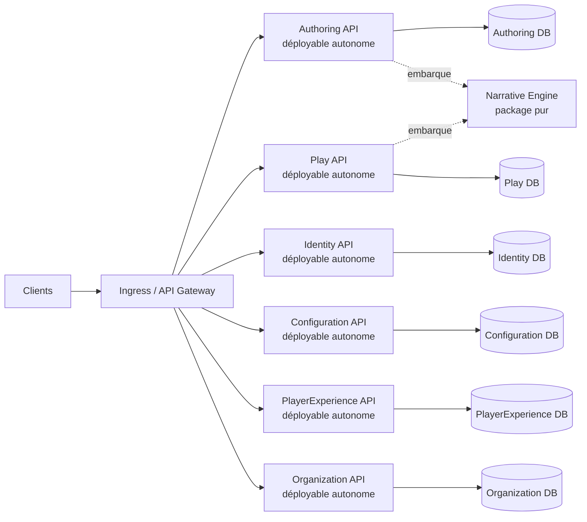

<div align="center">

# GenEngine

**Backend narratif distribué, déterministe et extensible en .NET 10 LTS.**

[](https://github.com/JordanLacroix/GenEngine/actions/workflows/ci.yml)
[](https://github.com/JordanLacroix/GenEngine/actions/workflows/codeql.yml)
[](https://github.com/JordanLacroix/GenEngine/actions/workflows/scorecard.yml)
[](https://dotnet.microsoft.com/)
[](https://learn.microsoft.com/dotnet/csharp/)
[](#état-du-projet)
[](https://github.com/JordanLacroix/GenEngine/commits/main)
[](#licence)

[Vision](#vision) · [Démarrage rapide](#démarrage-rapide) · [Architecture](#architecture) · [Roadmap](#roadmap) · [Documentation](#documentation) · [Contribuer](#contribuer)

</div>

---

## Vision

GenEngine fournit le socle serveur d’expériences narratives de type « livre dont vous êtes le héros » : scénarios déclaratifs, conditions, effets, sessions, sauvegardes et publication de versions immuables.

Le projet vise un moteur :

- **déterministe** — mêmes versions, état, graine et commandes, même résultat ;
- **autoritatif** — le serveur contrôle les transitions et l’état des sessions ;
- **testable** — le cœur narratif reste une logique métier pure ;
- **portable** — aucun cloud ou fournisseur d’IA obligatoire ;
- **évolutif** — services indépendamment déployables, extensions ajoutées selon des besoins validés ;
- **sobre en dépendances** — licences permissives et compatibles avec un usage commercial.

> [!IMPORTANT]
> GenEngine a terminé le **jalon 3** et son socle narratif profond. Le **jalon 4** priorise maintenant la configuration exhaustive du moteur et de la plateforme, le RBAC à rôles custom, les organisations école/entreprise/formation, puis l'assistant/familier, les providers IA et l'économie/magasin.

## État du projet

| Élément | État |
|---|---|
| Solution .NET 10 et services autonomes | ✅ Authoring, Play, Identity, Configuration et PlayerExperience |
| Build sans warning | ✅ Vérifié |
| Frontières de dépendance automatisées | ✅ Vérifiées en CI |
| Health checks API | ✅ Disponibles |
| Spécifications et invariants initiaux | ✅ Documentés |
| Scénarios JSON de référence | ✅ Trois scénarios |
| Moteur narratif en mémoire | ✅ Déterministe et testé |
| État joueur riche, choix explicables et simulation de branches | ✅ Fonctionnel et testé |
| Interactions typées, gates et texte libre confirmé | ✅ Fonctionnel et testé |
| Analyse de boucles/impasses et prévisualisation auteur | ✅ Exposée par Authoring |
| PostgreSQL et sessions persistées | ✅ Une base par service |
| Docker Compose | ✅ Parcours jouable automatisé |
| Catalogue public des versions publiées | ✅ Consommable par les clients Web et iOS |
| Observabilité OpenTelemetry | 🚧 Logs, traces et métriques disponibles localement |
| SLI/SLO et alertes | 🚧 Objectifs provisoires, règles Prometheus validées et budget d’erreur dans Grafana |
| Configuration moteur/plateforme, vocabulaire, rôles custom et organisations | 🚧 Service Organization, memberships et affectations runtime disponibles |
| Assistant/familier et aide hors ligne | 🚧 Profil illustré, nom, ton, aide, fréquence et fallback contextuel disponibles ; provider IA assistant restant |
| Introduction, tutoriel et shell joueur configurables | ✅ Publiés par Configuration et consommés par Web/iOS |
| Médias configurables (visuels, sons, animations) | ✅ Médias optionnels de scénario en schéma v3, ambiances par emplacement et game over publiés par Configuration |
| Progression cross-session et journal joueur | ✅ Alimentés automatiquement par Play, persistés par PlayerExperience |
| IA provider-agnostic, metering et quotas | 🚧 Offline + Azure AI Foundry disponibles, quotas à venir |
| Économie, récompenses et magasin configurable | 🚧 Portefeuille, règles, achats et crédits narratifs idempotents disponibles |
| Fonctionnalités de plateforme avancées | ⏸️ Après les fondations configurables |

La progression détaillée est suivie dans [`specs/roadmap.md`](specs/roadmap.md) et dans les fichiers `tasks.md` de chaque module.

## Démarrage rapide

### Prérequis

- [.NET SDK 10](https://dotnet.microsoft.com/download/dotnet/10.0) — version attendue définie dans [`global.json`](global.json) ;
- Git ;
- Docker avec Docker Compose pour lancer la stack complète ;
- `curl`, `jq` et `uuidgen` pour le smoke test.

### Cloner et vérifier

```bash
git clone https://github.com/JordanLacroix/GenEngine.git
cd GenEngine

dotnet restore --locked-mode
dotnet build --no-restore -warnaserror
dotnet test --no-build
```

Les tests d’architecture protègent le graphe de dépendances et les tests Narrative couvrent les comportements déterministes du moteur.

### Lancer la stack Docker

```bash
docker compose up --build --detach --wait
./scripts/smoke-test.sh
./scripts/typed-interactions-smoke-test.sh
./scripts/free-text-smoke-test.sh
./scripts/deferred-effects-smoke-test.sh
docker compose down
```

Compose démarre six API et six PostgreSQL isolés. Le smoke vérifie aussi l'expérience publiée par Configuration, le bootstrap joueur, l'onboarding persistant, le journal et l'aide contextuelle, puis couvre le jeu global, les catégories, les familiers, l'économie et le provider Foundry sans fuite de secret. Les quatre parcours narratifs vérifient le jeu classique, les interactions typées, le texte libre confirmé, puis les effets différés et la projection joueur. Le smoke administratif complet est conçu pour une base Identity vierge : dès qu'un premier administrateur existe, l'API refuse volontairement un second bootstrap. Les valeurs par défaut sont réservées au développement local ; copiez `.env.example` vers `.env`, configurez notamment une clé de bootstrap aléatoire, puis remplacez tous les secrets dès que l’environnement est partagé.

### Lancer l’observabilité locale

```bash
docker compose -f compose.yaml -f compose.observability.yaml up --build --detach --wait
./scripts/smoke-test.sh
```

La surcouche ajoute le Collector OpenTelemetry et les trois signaux corrélés : métriques dans Prometheus, traces dans Tempo et logs structurés dans Loki. Grafana est préconfiguré avec les sources de données et deux tableaux de bord : `GenEngine — Vue d’ensemble` et `GenEngine — SLO et budget d’erreur`.

| Interface | URL |
|---|---|
| Grafana | <http://localhost:3000> |
| Prometheus | <http://localhost:9090> |
| Tempo | <http://localhost:3200> — API uniquement |
| Loki | <http://localhost:3100> — API uniquement |

Prometheus charge des règles versionnées sous [`deploy/observability/rules/`](deploy/observability/rules/) : indicateurs de service (disponibilité, taux d’erreurs, latence p95) et alertes de budget d’erreur. Les objectifs sont **provisoires** et documentés dans [`specs/process/slo.md`](specs/process/slo.md) ; les routes `/health/*` sont exclues du trafic utilisateur.

L’accès anonyme en lecture à Grafana est strictement réservé au développement local. La stack de base et le smoke test CI restent indépendants de cette surcouche.

### Lancer les services

```bash
dotnet run --project src/Services/Authoring/GenEngine.Authoring.Api --launch-profile http
dotnet run --project src/Services/Play/GenEngine.Play.Api --launch-profile http
dotnet run --project src/Services/Identity/GenEngine.Identity.Api --launch-profile http
dotnet run --project src/Services/Configuration/GenEngine.Configuration.Api
dotnet run --project src/Services/PlayerExperience/GenEngine.PlayerExperience.Api
dotnet run --project src/Services/Organization/GenEngine.Organization.Api
```

Chaque commande utilise un terminal distinct. Vérifier ensuite les health checks :

```bash
curl http://localhost:5201/health/live
curl http://localhost:5202/health/live
curl http://localhost:5203/health/live
curl http://localhost:5204/health/live
curl http://localhost:5205/health/live
curl http://localhost:5206/health/live
```

| Endpoint | Rôle |
|---|---|
| `GET /health/live` | Confirme que le processus répond |
| `GET /health/ready` | Confirme que les dépendances indispensables sont disponibles |

## Architecture

GenEngine est un **backend distribué DDD/Clean** : six services indépendamment déployables et un moteur narratif pur, embarqué sous forme de package versionné.



### Modules

| Projet | Responsabilité |
|---|---|
| `GenEngine.Narrative` | Package pur : modèle, conditions, runtime, PRNG, hash et compatibilité de format |
| `GenEngine.Authoring.*` | Service autonome d’import, validation, brouillons, versioning et publication |
| `GenEngine.Play.*` | Service autonome de sessions, commandes, idempotence, pause et reprise |
| `GenEngine.Identity.*` | Service autonome d’authentification locale et d’autorisation |
| `GenEngine.Configuration.*` | Service autonome de configuration versionnée du jeu, des providers, familiers, modules et économie |
| `GenEngine.PlayerExperience.*` | Service autonome du bootstrap joueur, onboarding, familier, progression, journal, portefeuille, récompenses et possessions |
| `GenEngine.Organization.*` | Service autonome des fronts opérationnels, unités, memberships, encadrants et affectations de contenu |

### Règles de dépendance

1. `Narrative` ne référence ni ASP.NET Core, ni EF Core, ni un service.
2. Aucun service ne possède de référence de projet vers un autre service.
3. Chaque service possède son Domain, ses cas d’usage, son infrastructure, son API et sa base.
4. `Domain` ne dépend de rien ; les dépendances pointent vers lui.
5. Les échanges interservices utilisent des contrats versionnés, jamais des entités ou tables partagées.
6. Une liste blanche exhaustive protège le graphe de projets dans les tests d’architecture.

## Structure du dépôt

```text
GenEngine/
├── src/
│   ├── Engine/
│   │   └── GenEngine.Narrative/
│   ├── BuildingBlocks/
│   │   └── GenEngine.Observability/
│   └── Services/
│       ├── Authoring/         # Domain · Application · Infrastructure · Api
│       ├── Play/              # Domain · Application · Infrastructure · Api
│       ├── Identity/          # Domain · Application · Infrastructure · Api
│       ├── Configuration/     # Domain · Application · Infrastructure · Api
│       └── PlayerExperience/  # Domain · Application · Infrastructure · Api
├── tests/
│   ├── GenEngine.Narrative.Tests/
│   ├── GenEngine.Services.Tests/
│   ├── GenEngine.Architecture.Tests/
│   └── GenEngine.*.IntegrationTests/
├── specs/
├── .github/workflows/
└── GenEngine.sln
```

## Principes techniques

- Les scénarios sont déclaratifs et typés ; aucun script auteur arbitraire n’est exécuté.
- Une version publiée est immuable et possède un hash canonique.
- Une session reste attachée à sa version publiée initiale.
- Le moteur ne réalise aucun accès réseau, disque ou base de données.
- Les commandes joueur sont idempotentes et protégées par une révision optimiste.
- L’IA est facultative, interchangeable, exclue du chemin déterministe et possède toujours un fallback hors ligne.
- Chaque fonctionnalité déclare configuration, valeurs par défaut, permissions RBAC, audit et comportement désactivé.
- Les fronts, écoles, entreprises, classes, équipes, parcours et catégories restent configurables sans imposer un vocabulaire métier unique.

Les invariants normatifs sont listés dans [`specs/invariants.md`](specs/invariants.md).

## Commandes de développement

```bash
# Restauration reproductible
dotnet restore --locked-mode

# Compilation stricte
dotnet build --no-restore -warnaserror

# Tests
dotnet test --no-build

# Audit des vulnérabilités directes et transitives
dotnet list GenEngine.sln package --vulnerable --include-transitive

# Lancement local d’un service
dotnet run --project src/Services/Play/GenEngine.Play.Api --launch-profile http

# Sauvegarde chiffrée des trois bases (voir specs/process/backup-restore.md)
BACKUP_AGE_PASSPHRASE='…' scripts/backup-databases.sh

# Restauration : dry-run par défaut, base temporaire avec --target-db
BACKUP_AGE_PASSPHRASE='…' scripts/restore-database.sh authoring-db backups/authoring-db-<UTC>.dump.age
```

Les versions NuGet sont centralisées dans [`Directory.Packages.props`](Directory.Packages.props) et verrouillées par projet avec `packages.lock.json`.

## Qualité et sécurité

- nullable activé ;
- C# 14 et .NET 10 LTS ;
- warnings traités comme erreurs ;
- restore NuGet verrouillé en CI ;
- dépendances directes et transitives auditées ;
- GitHub Actions avec permissions minimales ;
- actions tierces épinglées par SHA et auditées par zizmor ;
- images Docker de base épinglées par digest et suivies par Dependabot ;
- CodeQL, Trivy, Dependency Review et OpenSSF Scorecard ;
- SBOM SPDX générée automatiquement sur `main` ;
- Dependabot, secret scanning et push protection ;
- aucune donnée personnelle ou texte libre dans les logs par défaut ;
- audit métier des opérations sensibles sans secret ni donnée personnelle (voir [`specs/process/audit.md`](specs/process/audit.md)) ;
- sauvegarde et restauration chiffrées (age) des trois bases, testées et documentées (voir [`specs/process/backup-restore.md`](specs/process/backup-restore.md)) ;
- threat model requis avant toute exposition publique de l’API.

Le workflow [`ci.yml`](.github/workflows/ci.yml) exécute la restauration, le build strict et les tests à chaque pull request et push sur `main`. La matrice complète des protections, outils actifs et intégrations différées est tenue dans [`specs/process/github-governance.md`](specs/process/github-governance.md).

## Documentation

| Document | Contenu |
|---|---|
| [`specs/README.md`](specs/README.md) | Index documentaire et sources de vérité |
| [`specs/roadmap.md`](specs/roadmap.md) | Jalons et progression |
| [`specs/functional-roadmap.md`](specs/functional-roadmap.md) | Priorités fonctionnelles P0 à P4 |
| [`specs/product-capability-map.md`](specs/product-capability-map.md) | État honnête de chaque domaine du plan initial |
| [`specs/platform-configuration.md`](specs/platform-configuration.md) | Configuration, organisations, RBAC, assistant et IA |
| [`specs/configuration-catalog.md`](specs/configuration-catalog.md) | Catalogue exhaustif moteur, providers IA, économie et modules |
| [`specs/handoff.md`](specs/handoff.md) | État vérifié et prochaine unité de travail |
| [`specs/architecture.md`](specs/architecture.md) | Modules et règles de dépendance |
| [`specs/invariants.md`](specs/invariants.md) | Invariants non négociables |
| [`specs/glossary.md`](specs/glossary.md) | Vocabulaire métier |
| [`specs/adr/`](specs/adr/) | Architecture Decision Records |
| [`specs/modules/narrative/tasks.md`](specs/modules/narrative/tasks.md) | Tâches du premier module |
| [`specs/modules/hardening/tasks.md`](specs/modules/hardening/tasks.md) | Tâches du jalon de durcissement |
| [`specs/process/github-governance.md`](specs/process/github-governance.md) | Gouvernance GitHub, CI/CD et sécurité |
| [`specs/process/slo.md`](specs/process/slo.md) | SLI, SLO provisoires, alertes et budget d’erreur |
| [`specs/process/audit.md`](specs/process/audit.md) | Audit métier : événements, politique de non-fuite et consultation |
| [`specs/process/resilience.md`](specs/process/resilience.md) | Résilience interservices : timeouts, retry et circuit breaker |
| [`specs/process/threat-model.md`](specs/process/threat-model.md) | Menaces, frontières de confiance et mitigations initiales |
| [`specs/process/backup-restore.md`](specs/process/backup-restore.md) | Sauvegarde/restauration chiffrées des bases, clés dev/prod et procédure de test |
| [`specs/api/http.md`](specs/api/http.md) | Contrats HTTP publics et interservices |
| [`specs/domain/`](specs/domain/) | Scénarios, runtime, déterminisme et exemples exécutables |

### Maintenir ce README

Le README doit rester une représentation exacte du projet. Toute PR modifiant l’un des éléments suivants doit vérifier et, si nécessaire, mettre à jour ce fichier :

- prérequis ou commandes de démarrage ;
- architecture, modules ou dépendances ;
- endpoints publics ;
- statut d’un jalon ;
- politique de sécurité ou de licence ;
- liens vers la documentation ;
- badges et workflow CI.

Ne jamais annoncer une fonctionnalité comme disponible avant qu’elle soit implémentée et vérifiée.

## Roadmap

| Jalon | Objectif | Statut |
|---|---|---|
| **0 — Cadrage** | Scénarios de référence, invariants, JSON polymorphe, PRNG, hash et ADR | ✅ Terminé |
| **1 — Moteur en mémoire** | Domain, evaluator, reducer, runtime, validation et tests déterministes | ✅ Terminé |
| **2 — Backend jouable** | Services autonomes, PostgreSQL séparés, publication, sessions, auth et Docker | ✅ Terminé |
| **3 — Durcissement** | Observabilité complète, sécurité, résilience et sauvegarde/restauration | ✅ Terminé |
| **4 — Plateforme fonctionnelle configurable** | Configuration exhaustive, RBAC custom, organisations, assistant, IA et magasin | 🚧 En cours |

## Contribuer

Consultez [`CONTRIBUTING.md`](CONTRIBUTING.md), puis utilisez le formulaire de bug ou de fonctionnalité adapté. Chaque changement passe par une pull request structurée, des commits conventionnels et les contrôles automatisés requis.

- [Ouvrir un bug](https://github.com/JordanLacroix/GenEngine/issues/new?template=bug.yml)
- [Proposer une fonctionnalité](https://github.com/JordanLacroix/GenEngine/issues/new?template=feature.yml)
- [Poser une question](https://github.com/JordanLacroix/GenEngine/discussions)
- [Consulter la politique de sécurité](SECURITY.md)

## Licence

Le dépôt est public, mais **aucune licence du code source n’a encore été choisie**. En l’absence de fichier `LICENSE`, le code reste soumis au droit d’auteur par défaut et sa réutilisation n’est pas automatiquement autorisée.

La licence du projet sera choisie explicitement avant la première distribution. Les dépendances intégrées doivent, elles, rester permissives et compatibles avec un usage commercial.

---

<div align="center">

**GenEngine — construire d’abord un moteur narratif fiable, puis étendre une fonctionnalité à la fois.**

</div>
