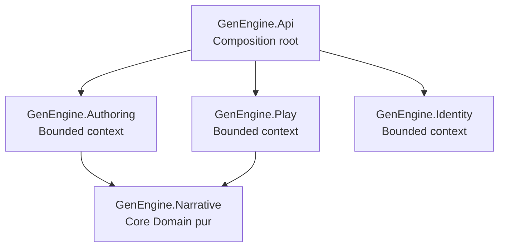

# Architecture

## Décision

GenEngine est un **monolithe modulaire DDD/Clean pragmatique** : un seul déployable et une frontière de compilation par bounded context. Chaque module possède son modèle métier, ses cas d’usage et ses adaptateurs techniques.

Cette organisation privilégie des frontières métier fortes sans créer prématurément un projet .NET par couche. Un module ne sera éclaté en plusieurs assemblies que lorsque sa taille, son équipe ou ses contraintes de déploiement le justifieront.

La décision et ses alternatives sont détaillées dans [`adr/0001-pragmatic-ddd-clean-modular-monolith.md`](adr/0001-pragmatic-ddd-clean-modular-monolith.md).

## Contextes délimités

| Module | Type DDD | Responsabilité et données possédées |
|---|---|---|
| `Narrative` | Core Domain | Modèle narratif, invariants, évaluation, reducer, runtime déterministe, PRNG, hash et migrations de format |
| `Authoring` | Supporting | Brouillons, import, validation, versioning et publication |
| `Play` | Core/Supporting | Sessions, commandes, idempotence, sauvegarde, pause et reprise |
| `Identity` | Generic | Authentification locale, acteurs et politiques d’autorisation |
| `Api` | Hôte | Composition, transport HTTP, OpenAPI, middleware et démarrage du processus |

Le vocabulaire métier est défini dans [`glossary.md`](glossary.md). Une frontière de module ne doit pas être contournée sous prétexte de réutilisation technique.

## Graphe de dépendances autorisé



Toute flèche absente est interdite. Ce graphe est vérifié par `GenEngine.Architecture.Tests` à chaque CI.

## Clean Architecture à l’intérieur d’un module

Les fonctionnalités sont ajoutées en **tranches verticales**. Les dossiers ne sont créés que lorsqu’ils contiennent du code :

```text
GenEngine.<Module>/
├── Domain/                    # Entités, value objects, règles et événements métier
├── Application/               # Cas d’usage et ports, organisés par fonctionnalité
│   └── <Feature>/
├── Infrastructure/            # EF Core, repositories et adaptateurs du module
└── Api/                       # Endpoints et contrats HTTP propres au module
```

Les dépendances pointent vers l’intérieur :

```text
Api ───────────────┐
Infrastructure ────┼──> Application ───> Domain
                   └────────────────────> Domain
```

- `Domain` ne dépend d’aucun framework, stockage, transport ou horloge système.
- `Application` orchestre les cas d’usage et définit les ports dont elle a besoin.
- `Infrastructure` implémente les ports du **même module** ; il n’existe pas de projet infrastructure global.
- `Api` traduit HTTP vers les cas d’usage et ne contient pas de décision métier.
- Les types concrets restent `internal` par défaut. La surface publique d’un module est volontaire et minimale.

`Narrative` est plus strict : il reste une bibliothèque pure et déterministe, sans couches HTTP ou persistance.

## Communication entre modules

1. `Authoring` et `Play` utilisent directement l’API publique stable du moteur `Narrative`.
2. Les autres collaborations passent par des contrats explicites ou des événements d’intégration ; jamais par les entités internes d’un autre module.
3. Une transaction locale ne modifie que les données du module propriétaire.
4. Aucun module ne partage son `DbContext`, ses repositories ou ses tables.
5. La cohérence entre modules est orchestrée explicitement et, lorsqu’elle peut être différée, devient éventuelle et idempotente.
6. Une extraction en service séparé doit rester possible sans réécrire le modèle métier.

## Persistance

Le déploiement peut utiliser une seule instance PostgreSQL, mais chaque module possède son schéma, ses migrations et son unité de travail. Les contraintes entre schémas et les lectures SQL transversales sont interdites. Les projections nécessaires à un autre module sont alimentées par des contrats dédiés.

## Pas de Shared Kernel par défaut

Un `SharedKernel` vide a été supprimé : en DDD, ce pattern implique un modèle partagé et une gouvernance forte, pas un dossier d’utilitaires. Une duplication locale modeste est préférable à un couplage accidentel.

Un Shared Kernel ne pourra être introduit que par ADR lorsqu’un concept métier réellement identique, stable et co-détenu par plusieurs contextes aura été identifié. Les helpers techniques génériques ne justifient pas ce pattern.

## Règles automatisées

`GenEngine.Architecture.Tests` lit les `ProjectReference` des projets sous `src/` et compare le graphe réel à une liste blanche exhaustive. Ajouter un projet ou une dépendance nécessite donc une décision d’architecture explicite et une mise à jour du test.

Les futures règles au niveau des namespaces devront notamment garantir :

- aucune dépendance de `Domain` vers `Application`, `Infrastructure` ou `Api` ;
- aucune dépendance de `Application` vers `Infrastructure` ou `Api` ;
- aucun accès aux namespaces internes d’un autre bounded context ;
- aucun type EF Core ou ASP.NET Core dans le Domain.

## Critères d’éclatement d’un module

Un module peut être séparé en projets `Domain`, `Application`, `Infrastructure` et `Api` si au moins un signal concret apparaît : cycles difficiles à empêcher, compilation ou tests trop lents, plusieurs équipes propriétaires, réutilisation autonome du Domain, ou besoin de déploiement distinct. L’éclatement n’est pas utilisé comme décoration architecturale.

## Dépendances externes

Toute dépendance doit répondre à un besoin identifié, être maintenue, compatible avec .NET 10, permissive et compatible avec un usage commercial. Le Domain narratif privilégie la bibliothèque standard.
