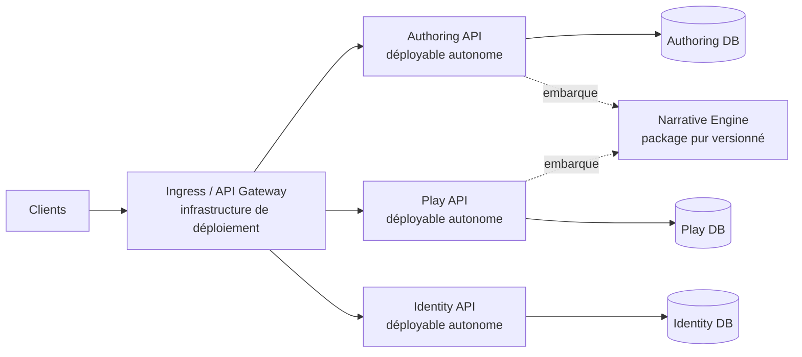

# Architecture

## Décision

GenEngine adopte une **architecture distribuée orientée services**, structurée avec DDD et Clean Architecture. Il n’existe aucun déployable backend global : `Authoring`, `Play` et `Identity` sont trois services autonomes, versionnés et déployables indépendamment.

Le moteur `Narrative` est une bibliothèque métier pure et versionnée. Il est embarqué dans les services qui doivent valider ou exécuter une narration afin de préserver le déterminisme et d’éviter un appel réseau dans la boucle d’exécution.

La décision et ses compromis sont détaillés dans [`adr/0002-distributed-clean-services.md`](adr/0002-distributed-clean-services.md). L’ADR 0001 est remplacé par cette décision.

## Topologie



L’ingress n’est pas une application métier et ne compose pas les services en processus. Il assure uniquement TLS, routage, limitation de débit et éventuellement agrégation de documentation. Chaque API reste directement testable et déployable sans lui.

## Services et ownership

| Service | Sous-domaine DDD | Responsabilité | Données possédées |
|---|---|---|---|
| `Authoring` | Supporting | Import, brouillons, validation, versioning et publication | Auteurs, brouillons, versions publiées et métadonnées éditoriales |
| `Play` | Core/Supporting | Sessions, commandes, idempotence, sauvegarde, pause et reprise | Sessions, états, historique de commandes et projections de jeu |
| `Identity` | Generic | Authentification locale, acteurs et politiques d’autorisation | Comptes, credentials, rôles et clés de sécurité |
| `Configuration` | Supporting | Configuration publiée du produit et du jeu | Fronts configurés, branding, catalogue, providers et politiques |
| `PlayerExperience` | Supporting | Expérience et progression personnelles | Onboarding, familier, journal, progression, portefeuille et possessions |
| `Organization` | Supporting | Exploitation des écoles, entreprises et organismes | Fronts opérationnels, unités, memberships, encadrement et affectations |
| `Narrative` | Core Domain partagé sous forme de package | Modèle narratif, invariants, evaluator, reducer, runtime, PRNG et hash | Aucune donnée persistée |

Un service ne lit ni la base, ni le `DbContext`, ni les assemblies internes d’un autre service.

### Extensions fonctionnelles planifiées

Le jalon 4 prévoit d'étendre la topologie par bounded contexts autonomes, sans agrandir les services existants jusqu'au spaghetti :

| Service candidat | Ownership prévu | Statut |
|---|---|---|
| `Configuration` | Fronts, registre de settings, résolution hiérarchique, feature flags et modules | Implémenté, enrichissement P0 en cours |
| `Organization` | Écoles/entreprises/formations, unités, memberships et affectations runtime | Implémenté par ADR 0005, enrichissement P0 en cours |
| `Assistant` | Familiers, politiques d'aide, adaptateurs IA, metering et quotas | ADR puis P1/P2 |
| `Economy` | Devises, wallet/ledger, récompenses, inventaire, magasins et achats | ADR puis P3 |

Chaque ajout doit posséder son Domain, son Application, son Infrastructure, son API et sa base. La frontière détaillée et les contrats seront validés avant code dans un ADR ; la cible fonctionnelle est décrite dans [`platform-configuration.md`](platform-configuration.md).

## Clean Architecture par service

Chaque service possède quatre projets et produit son propre exécutable :

```text
GenEngine.<Service>.Api
        │
        ├──────────────> GenEngine.<Service>.Infrastructure
        │                            │
        └──────────────> GenEngine.<Service>.Application
                                     │
                                     v
                         GenEngine.<Service>.Domain
```

- `Domain` contient entités, value objects, agrégats, invariants et événements métier. Il ne dépend de rien.
- `Application` contient les cas d’usage et les ports. Il dépend du Domain et, uniquement pour `Authoring` et `Play`, du package pur `Narrative`.
- `Infrastructure` implémente les ports du service : persistance, bus, horloge, stockage et clients distants.
- `Api` est le composition root HTTP du service. Elle assemble Application et Infrastructure sans logique métier.

Les dépendances inverses ou transversales sont interdites et vérifiées par `GenEngine.Architecture.Tests`.

## Communication interservices

1. Aucun `ProjectReference` n’est autorisé entre deux services.
2. Les commandes synchrones utilisent HTTP avec contrats OpenAPI versionnés, timeouts courts et propagation d’un identifiant de corrélation.
3. Les changements d’état diffusables utilisent des événements d’intégration versionnés et idempotents lorsqu’un consommateur réel existe.
4. Les modèles de domaine et contrats de persistance ne traversent jamais une frontière de service.
5. Chaque consommateur traduit un contrat externe vers son propre modèle via une anti-corruption layer.
6. Les workflows multi-services n’utilisent pas de transaction distribuée ; ils sont explicitement orchestrés ou chorégraphiés avec compensation.

Au démarrage, `Play` ne dépend pas d’un appel synchrone à `Identity` pour chaque commande : il valide localement les jetons signés. Les données narratives publiées nécessaires au jeu sont répliquées ou récupérées hors de la boucle critique, puis identifiées par version et hash.

## Données et cohérence

Chaque service possède une base PostgreSQL logique et ses migrations. Une même instance physique peut être utilisée en développement, mais avec credentials, bases et cycles de migration séparés. Les foreign keys et requêtes SQL interservices sont interdites.

La cohérence forte s’arrête à la frontière du service. Les échanges interservices sont rejouables et idempotents. Le pattern outbox ne sera ajouté qu’au premier événement d’intégration réellement nécessaire.

## Moteur Narrative partagé

`GenEngine.Narrative` n’est pas un service réseau. Le rendre distant introduirait latence, panne partagée et nondéterminisme opérationnel dans chaque commande de jeu.

Le moteur est donc :

- sans ASP.NET Core, EF Core, I/O, réseau ou horloge implicite ;
- versionné comme un package interne ;
- embarqué par `Authoring.Application` pour validation et par `Play.Application` pour exécution ;
- couvert par des scénarios de compatibilité afin qu’une version publiée produise le même résultat dans les deux services.

## Déploiement

Les trois API disposent chacune de leur image, configuration, health checks, migrations et pipeline de livraison. Un changement dans un service ne doit pas imposer le redéploiement des autres, sauf montée explicite de la version du moteur `Narrative`.

Le développement local utilisera Docker Compose à partir du jalon 2. La production pourra choisir un orchestrateur sans modifier les couches métier.

## Règles automatisées

`GenEngine.Architecture.Tests` compare chaque `ProjectReference` sous `src/` à une liste blanche exhaustive. L’ajout d’un projet ou d’une dépendance non prévue fait échouer la CI.

Des tests supplémentaires seront ajoutés avec le code pour garantir :

- aucune référence de `Domain` vers un framework ou une couche externe ;
- aucune référence d’`Application` vers `Infrastructure` ou `Api` ;
- aucune référence de code entre services ;
- aucune API publique accidentelle dans les couches internes ;
- compatibilité déterministe des versions du moteur Narrative.

## Dépendances externes

Toute dépendance doit répondre à un besoin identifié, être maintenue, compatible avec .NET 10, permissive et compatible avec un usage commercial. Le moteur Narrative privilégie la bibliothèque standard.
